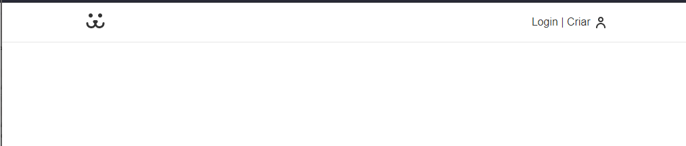

# Header

Primeiramente nós iremos fazer a importação da nossa marca no header da aplicação, nós iremos importar o svg como um componente e iremos passar no lugar o Home:

```javascript
import React from "react";
import { Link } from "react-router-dom";
import styles from "./Header.module.css";
import { ReactComponent as Dogs } from "../Assets/dogs.svg";

export const Header = () => {
  return (
    <div className={styles.header}>
      <nav className="container">
        <Link to="/">
          <Dogs />
        </Link>
        <Link to="/login">Login | Criar</Link>
      </nav>
    </div>
  );
};
```

E como nós queremos estilizar tanto a logo quanto o login, passamos o className para eles, e como queremos passar dois estilos para o nav, ele terá o styles.nav container:

```javascript
<nav className={`${styles.nav} container`}>
  <Link className={styles.logo} to="/" aria-label="Dogs - Home">
    <Dogs />
  </Link>
  <Link className={styles.login} to="/login">
    Login | Criar
  </Link>
</nav>
```

Agora podemos estilizar o Header:

```css
.header {
  box-shadow: 0px 1px 1px rgba(0, 0, 0, 0.1);
  position: fixed;
  width: 100%;
  z-index: 100;
  background: white;
  top: 0;
}

.nav {
  display: flex;
  /* separar a marca e o button de login */
  justify-content: space-between;
  align-items: center;
  height: 4rem;
}

.logo {
  padding: 0.5rem 0;
}

.login {
  color: #333;
  display: flex;
  align-items: center;
}

.login::after {
  content: "";
  display: inline-block;
  width: 14px;
  height: 17px;
  background: url("../Assets/usuario.svg") no-repeat center center;
  margin-left: 0.5rem;
}
```

Assim vai estar nosso Header:


