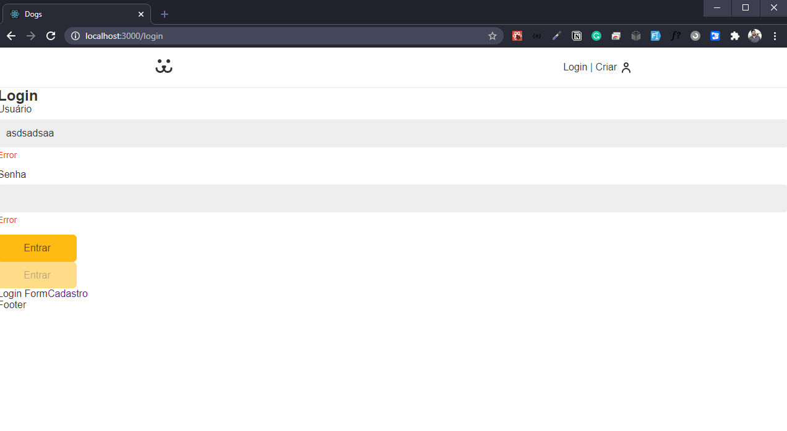

# Componentes para usar nos formulários

Iremos agora criar dois componentes que iremos usar e reutilizar em mais de um formulário, que será o Button e o Input:

```javascript
import React from "react";
import styles from "./Button.module.css";

export const Button = () => {
  return <button className={styles.button}></button>;
};
```

```javascript
import React from "react";
import styles from "./Input.module.css";

export const Input = () => {
  return <input className={styles.input} />;
};
```

Agora nós vamos importar primeiramente o Input na nossa página do LoginForm e iremos passar as propriedades que vamos utilizar para ele e receber dentro do componente.

Primeiramente iremos passar a label:

```javascript
<Input label="Usuário" />
```

```javascript
export const Input = ({ label }) => {
  return (
    <div>
      <label htmlFor="">{label}</label>
      <input className={styles.input} />;
    </div>
  );
};
```

Agora o tipo, se é um text ou password:

```javascript
<Input label="Usuário" type="text" />
```

```javascript
export const Input = ({ label, type }) => {
  return (
    <div>
      <label htmlFor="">{label}</label>
      <input className={styles.input} type={type} />
    </div>
  );
};
```

Agora temos que passar a propriedade name, que tem que ser único e iremos utilizar para mandar para a requisição no backend:

```javascript
  <Input label="Usuário" type="text" name="username" />
  <Input label="Senha" type="password" name="password" />
```

```javascript
  <label htmlFor={name}>{label}</label>
  <input className={styles.input} type={type} id={name} name={name} />
```

Agora iremos fazer a parte do button, onde iremos passar o type e receber o type e o children no component:

```javascript
<Button type="submit">Entrar</Button>
```

```javascript
export const Button = ({ type, children }) => {
  return (
    <button type={type} className={styles.button}>
      {children}
    </button>
  );
};
```

Agora vamos estilizar o Button:

```css
.button {
  font-size: 1rem;
  font-family: var(--type-first);
  cursor: pointer;
  border: none;
  border-radius: 0.4rem;
  background: #fb1;
  color: #764701;
  padding: 0.8rem 1.2rem;
  box-sizing: border-box;
  transition: 0.1s;
}

.button:hover,
.button:focus {
  outline: none;
  box-shadow: 0 0 0 3px #fea, 0 0 0 4px #fb1;
}
```

Podemos voltar no button e passar os `...props` que serão propriedades que não são obrigatórias, como o type, o disabled, onClick, onSubmit:

```javascript
export const Button = ({ children, ...props }) => {
  return (
    <button {...props} className={styles.button}>
      {children}
    </button>
  );
};
```

Agora vamos estilizar o input, primeiramennte vamos criar duas novas classes de estilo, para a div externa o `style.wrapper`,o `style.label` e criar um `<p>` com o Error:

```javascript
import React from "react";
import styles from "./Input.module.css";

export const Input = ({ label, type, name }) => {
  return (
    <div className={styles.wrapper}>
      <label htmlFor={name} className={styles.label}>
        {label}
      </label>
      <input id={name} name={name} className={styles.input} type={type} />
      <p className={styles.error}>Error</p>
    </div>
  );
};
```

Agora a estilização dos campos:

```css
.wrapper {
  margin-bottom: 1rem;
}

.input {
  border: 1px solid #eee;
  display: block;
  width: 100%;
  font-size: 1rem;
  padding: 0.8rem;
  border-radius: 0.4rem;
  background: #eee;
  transition: 0.2s;
}

.input:focus,
.input:hover {
  outline: none;
  border-color: #fb1;
  background: white;
  box-shadow: 0 0 0 3px #fea;
}

.label {
  display: block;
  font-size: 1rem;
  line-height: 1;
  padding-bottom: 0.5rem;
}

.error {
  color: #f31;
  font-size: 0.875rem;
  margin-top: 0.25rem;
}
```

Assim ficando nossa tela:


