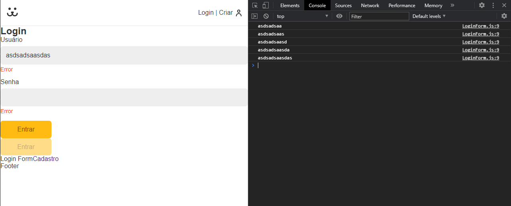

# useForm

Agora nós iremos criar um hook chamado useForm.

Primeiro criamos o useForm com o value, setValue e a função de onChannge:

```javascript
import React from "react";

export const useForm = () => {
  const [value, setValue] = React.useState("");

  function onChange({ target }) {
    setValue(target.value);
  }

  return {
    value,
    setValue,
    onChange,
  };
};
```

Agora conseguimos resgatar essas definições no LoginForm:

```javascript

export const LoginForm = () => {
  const username = useForm();
  .
  .
  .
```

E com isso nós conseguimos passar via `spread` no input, para termos acesso ao value, setValue e onChange lá no input:

```javascript
<Input label="Usuário" type="text" name="username" {...username} />
```

Agora consneguimos desestruturar no `Input` e utilizar desses dados:

```javascript
import React from "react";
import styles from "./Input.module.css";

export const Input = ({ label, type, name, value, onChange }) => {
  return (
    <div className={styles.wrapper}>
      <label htmlFor={name} className={styles.label}>
        {label}
      </label>
      <input
        id={name}
        name={name}
        className={styles.input}
        type={type}
        value={value}
        onChange={onChange}
      />
      <p className={styles.error}>Error</p>
    </div>
  );
};
```

Agora podemos voltar no `loginForm` e teremos acesso ao valor que estamos escrevendo pelo `username.value`:

```javascript

export const LoginForm = () => {
  const username = useForm();
  console.log(username.value);

```



Agora podemos fazer o mesmo para o password para fazer o fetch:

```javascript
export const LoginForm = () => {
  const username = useForm();
  const password = useForm();

```

Nós agora vamos validar os erros, utilizando um regex e na função da validação, iremos ver se o value está vazio, se o type não é false e se passa na validação do regex:

```javascript
/* eslint-disable no-useless-escape */
import React from "react";

const types = {
  email: {
    regex: /^(([^<>()\[\]\\.,;:\s@"]+(\.[^<>()\[\]\\.,;:\s@"]+)*)|(".+"))@((\[[0-9]{1,3}\.[0-9]{1,3}\.[0-9]{1,3}\.[0-9]{1,3}\])|(([a-zA-Z\-0-9]+\.)+[a-zA-Z]{2,}))$/,
    message: "Preencha com um email válido",
  },
};

export const useForm = (type) => {
  const [value, setValue] = React.useState("");
  const [error, setError] = React.useState(null);

  function onChange({ target }) {
    setValue(target.value);
  }

  function validate(value) {
    if (type === false) return true;
    if (value.length === 0) {
      setError("Preencha um valor");
      return false;
    } else if (types[type] && !types[type].regex.test(value)) {
      setError(types[type].message);
      return false;
    } else {
      setError(null);
      return true;
    }
  }

  return {
    value,
    setValue,
    onChange,
    error,
    validate: () => validate(value),
    onBlur: () => validate(value),
  };
};
```

Agora vamos voltar lá no componente do `Input` e iremos passar a mensagem de error:

```javascript
import React from "react";
import styles from "./Input.module.css";

export const Input = ({
  label,
  type,
  name,
  value,
  onChange,
  error,
  onBlur,
}) => {
  return (
    <div className={styles.wrapper}>
      <label htmlFor={name} className={styles.label}>
        {label}
      </label>
      <input
        id={name}
        name={name}
        className={styles.input}
        type={type}
        value={value}
        onChange={onChange}
        onBlur={onBlur}
      />
      {error && <p className={styles.error}>{error}</p>}
    </div>
  );
};
```

E agora nós temos nosso método de validação, caso a gente precise de validar algo diferente de email, só inserir um novo regex e a mensagem de erro.

Assim ficará o nosso useForm no final:

```javascript
/* eslint-disable no-useless-escape */
import React from "react";

const types = {
  email: {
    regex: /^(([^<>()\[\]\\.,;:\s@"]+(\.[^<>()\[\]\\.,;:\s@"]+)*)|(".+"))@((\[[0-9]{1,3}\.[0-9]{1,3}\.[0-9]{1,3}\.[0-9]{1,3}\])|(([a-zA-Z\-0-9]+\.)+[a-zA-Z]{2,}))$/,
    message: "Preencha com um email válido",
  },
};

export const useForm = (type) => {
  const [value, setValue] = React.useState("");
  const [error, setError] = React.useState(null);

  function onChange({ target }) {
    error && validate(target.value);
    setValue(target.value);
  }

  function validate(value) {
    if (type === false) return true;
    if (value.length === 0) {
      setError("Preencha um valor");
      return false;
    } else if (types[type] && !types[type].regex.test(value)) {
      setError(types[type].message);
      return false;
    } else {
      setError(null);
      return true;
    }
  }

  return {
    value,
    setValue,
    onChange,
    error,
    validate: () => validate(value),
    onBlur: () => validate(value),
  };
};
```

Agora para que a gente não faça um submit sem passar pela validação, vamos colocar o validate dentro do `handleSubmit`:

```javascript
function handleSubmit(event) {
  event.preventDefault();

  if (username.validate() && password.validate()) {
    fetch("https://dogsapi.origamid.dev/json/jwt-auth/v1/token", {
      method: "POST",
      headers: {
        "Content-Type": "application/json",
      },
      body: JSON.stringify({
        username: username.value,
        password: password.value,
      }),
    })
      .then((res) => {
        console.log(res);
        return res.json();
      })
      .then((json) => console.log(json));
  }
}
```
